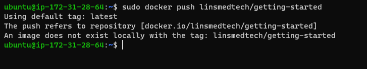
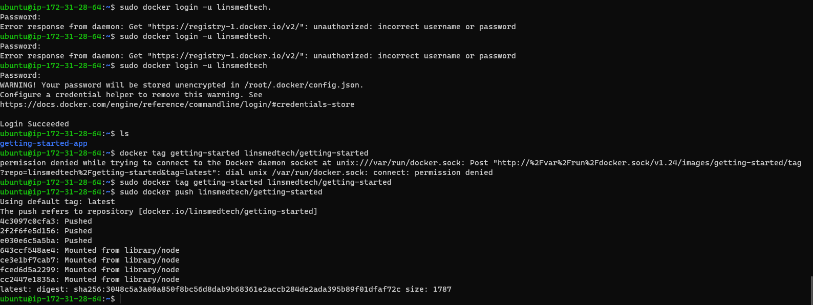
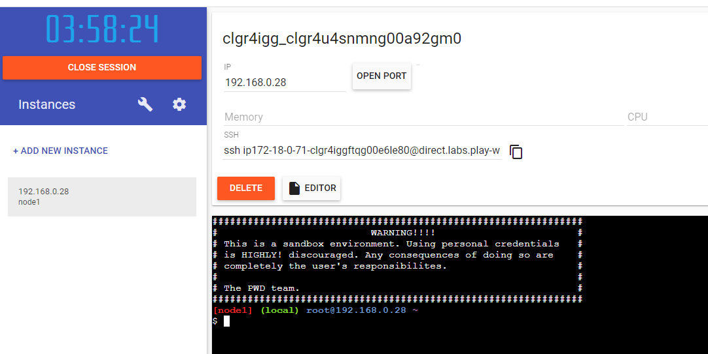
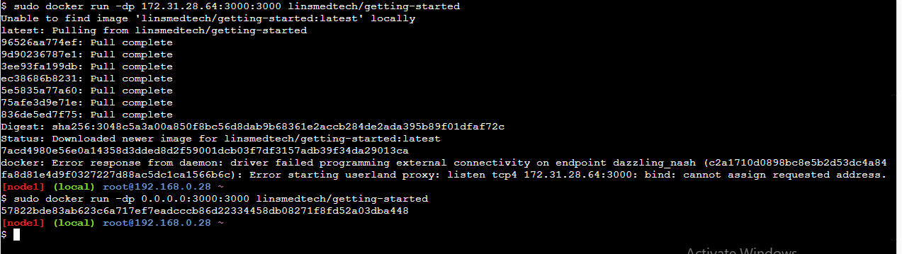

## Share the application

- Now that you've built an image, you can share it. To share Docker images, you have to use a Docker registry. The default registry is Docker Hub and is where all of the images you've used have come from

- A Docker ID lets you access Docker Hub, which is the world's largest library and community for container images. Create a [Docker ID](https://hub.docker.com/) for free if you don't have one.

## Create a repository

- To push an image, you first need to create a repository on Docker Hub.
1. [signup](https://www.docker.com/pricing/?utm_source=docker&utm_medium=webreferral&utm_campaign=docs_driven_upgrade&_gl=1*1356a36*_ga*MTgwODU1OTg5My4xNzAwMzI3MDA3*_ga_XJWPQMJYHQ*MTcwMDg5NzYxMS4xMi4xLjE3MDA4OTg4MDcuNTkuMC4w) or signin into [Dockerhub](https://hub.docker.com/?_gl=1*1v0r8io*_ga*MTgwODU1OTg5My4xNzAwMzI3MDA3*_ga_XJWPQMJYHQ*MTcwMDg5NzYxMS4xMi4xLjE3MDA4OTg5MTMuNjAuMC4w)

2. Select the **Create Repository** button.

3. For the repository name, use getting-started. Make sure the **Visibility** is **Public**.

4. Select **Create**

## Push the image

1. n the command line, run the docker push command that you see on Docker Hub. Note that your command will have your Docker ID, not "docker"

`sudo docker push docker/getting-started`

- Why did it fail? The push command was looking for an image named docker/getting-started, but didn't find one. If you run docker image ls, you won't see one either.

- To fix this, you need to tag your existing image you've built to give it another name.

2. Sign in to Docker Hub using the command docker login -u YOUR-USER-NAME.

3. Use the docker tag command to give the getting-started image a new name. Replace YOUR-USER-NAME with your Docker ID.

`sudo docker tag getting-started YOUR-USER-NAME/getting-started`

4. Now run the docker push command again. If you're copying the value from Docker Hub, you can drop the tagname part, as you didn't add a tag to the image name. If you don't specify a tag, Docker uses a tag called latest.

`docker push YOUR-USER-NAME/getting-started`

## Run the image on a new instance

- Now that your image has been built and pushed into a registry, try running your app on a brand new instance that has never seen this container image. To do this, you will use Play with Docker.

1. Open your browser to [Play with Docker](https://labs.play-with-docker.com/?_gl=1*g85abs*_ga*MTgwODU1OTg5My4xNzAwMzI3MDA3*_ga_XJWPQMJYHQ*MTcwMDkwMDEzNi4xMy4xLjE3MDA5MDA3MTEuNTYuMC4w)

2. Select **Login** and then select **docker** from the drop-down list.

3. Sign in with your Docker Hub account and then select Start.

4. Select the ADD NEW INSTANCE option on the left side bar. If you don't see it, make your browser a little wider. After a few seconds, a terminal window opens in your browser.

5. In the terminal, start your freshly pushed app.

`docker run -dp 0.0.0.0:3000:3000 YOUR-USER-NAME/getting-started`

- You should see the image get pulled down and eventually start up.

6. Select the 3000 badge when it appears.
- If the 3000 badge doesn't appear, you can select Open Port and specify 3000.