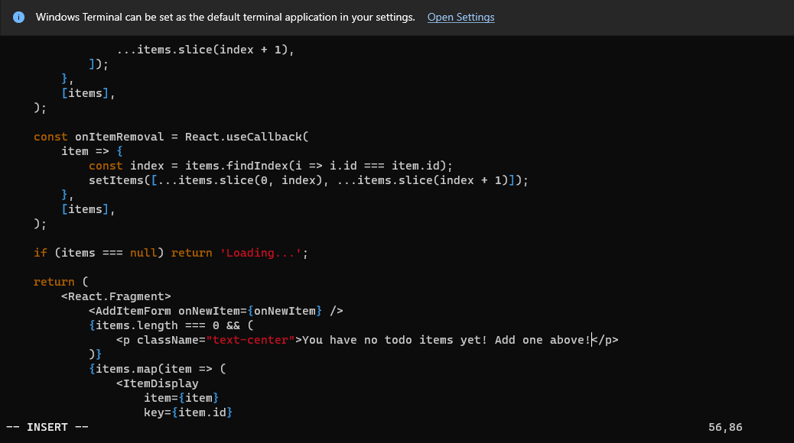
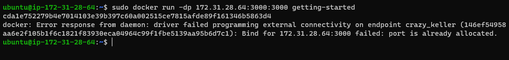
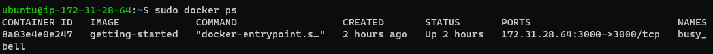
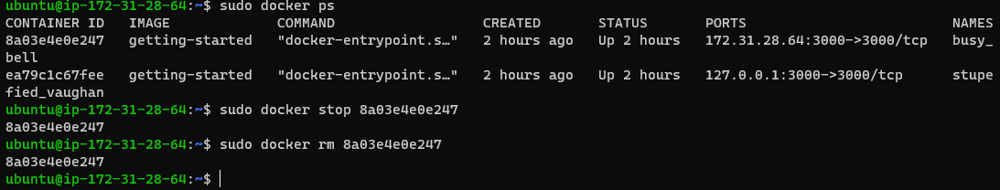
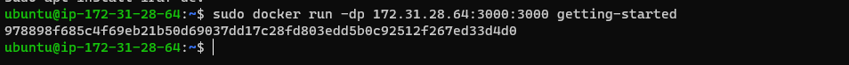
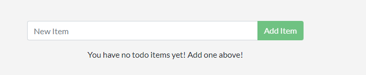

## Update the application
- In this part, we'll update the application and image. we'll also learn how to stop and remove a container.

- Update the source code

- In the following steps, you'll change the "empty text" when you don't have any todo list items to "You have no todo items yet! Add one above!"

1. In the src/static/js/app.js file, update line 56 to use the new empty text.

`- 
No items yet! Add one above!

+ 
You have no todo items yet! Add one above!
`

2. Build your updated version of the image, using the docker build command.

`docker build -t getting-started .`

3. Start a new container using the updated code.

` sudo docker run -dp 172.31.28.64:3000:3000 getting-started`

- You probably saw an error like this:

- The error occurred because you aren't able to start the new container while your old container is still running. The reason is that the old container is already using the host's port 3000 and only one process on the machine (containers included) can listen to a specific port. To fix this, you need to remove the old container.

## Remove the old container

- To remove a container, you first need to stop it. Once it has stopped, you can remove it. You can remove the old container using the CLI or Docker Desktop's graphical interface. Choose the option that you're most comfortable with.

### Remove a container using the CLI

1. Get the ID of the container by using the docker ps command.

`docker ps`

2. Use the docker stop command to stop the container. Replace <the-container-id> with the ID from docker ps.

`sudo docker stop <the-container-id>`

3. Once the container has stopped, you can remove it by using the docker rm command.

`sudo docker rm <the-container-id>`

## Start the updated app container
1. Now, start your updated app using the docker run command.

`docker run -dp 172.31.28.64:3000:3000 getting-started`

2. Refresh your browser on http://localhost:3000 and you should see your updated help text.
